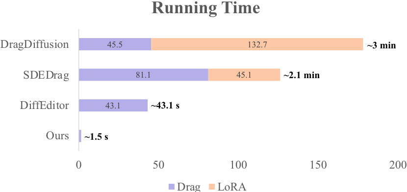
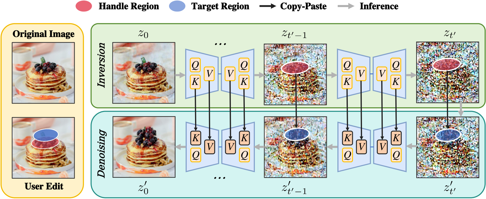

# RegionDrag: Fast Region-Based Image Editing with Diffusion Models (ECCV 2024)
 **Jingyi Lu†, [Xinghui Li‡](https://xinghui-li.github.io/), [Kai Han†](https://www.kaihan.org/)**<br>
[Visual AI Lab, The University of Hong Kong†](https://visailab.github.io/index.html); [Active Vision Lab, University of Oxford‡](https://www.robots.ox.ac.uk/ActiveVision/)

[](https://colab.research.google.com/drive/1pnq9t_1zZ8yL_Oba20eBLVZLp3glniBR?usp=sharing)
 <a href="https://visual-ai.github.io/regiondrag"></a>
 <a href="https://arxiv.org/abs/2407.18247"></a>
  <a href="https://drive.google.com/file/d/1rdi4Rqka8zqHTbPyhQYtFC2UdWvAeAGV/view?usp=sharing"></a>


<table> <tr> <td></td> <td></td> </tr> </table>

RegionDrag proposes to use pairs of **regions** instead of **points** (e.g. DragGAN, DragDiffusion) to drag image contents. Visit our [project page](https://visual-ai.github.io/regiondrag) for various region input examples.
- **A region is equivalent to a large number of points**, providing richer input context and improving image consistency.
- By using regions as input, we can reduce run time to **1.5 seconds** (close to 20-step SD image generation).

During inference, the SD latent representations of the inputted image are extracted from 🔴 **RED** regions during inversion and mapped to 🔵 **BLUE** regions during denoising across multiple timesteps.

## Installation
CUDA support is required to run our code, you can try our [Colab Demo](https://colab.research.google.com/drive/1pnq9t_1zZ8yL_Oba20eBLVZLp3glniBR?usp=sharing) for easy access to GPU resource. <br>
To locally install RegionDrag, run following using terminal:
```
git clone https://github.com/LuJingyi-John/RegionDrag.git
cd RegionDrag
pip install -r requirements.txt
```

## Run RegionDrag
After installing the requirements, you can simply launch the user inferface through:
```
python3 ui.py
```
For detailed instructions to use our UI, check out our [User Guide](./UI_GUIDE.md).

## DragBench-SR & DragBench-DR
To evaluate region-based editing, we introduce [DragBench-SR](https://github.com/ML-GSAI/SDE-Drag) and [DragBench-DR](https://github.com/Yujun-Shi/DragDiffusion/) (R is short for 'Region’), which are modified versions of DragBench-S (100 samples) and DragBench-D (205 samples). These benchmarks are consistent with their point-based counterparts but use regions instead of points to reflect user intention. You can download the dataset [HERE](https://drive.google.com/file/d/1rdi4Rqka8zqHTbPyhQYtFC2UdWvAeAGV/view?usp=sharing).


```
drag_data/
├── dragbench-dr/
│   ├── animals/
│   │   ├── JH_2023-09-14-1820-16/
│   │   │   ├── original_image.png
│   │   │   ├── user_drag.png
│   │   │   ├── meta_data.pkl
│   │   │   └── meta_data_region.pkl
│   │   └── ...
│   └── ...
└── dragbench-sr/
    ├── art_0/
    │   ├── original_image.png
    │   ├── user_drag.png
    │   ├── meta_data.pkl
    │   └── meta_data_region.pkl
    └── ...
```
`meta_data.pkl` or `meta_data_region.pkl` include user interaction metadata in a dictionary format:

  ```
  {
      'prompt': text_prompt describing output image,
      'points': list of points [(x1, y1), (x2, y2), ..., (xn, yn)], 
                handle points: (x1,y1), (x3,y3), ..., target points: (x2,y2), (x4,y4), ...,
      'mask': a binary mask specifying editing area,
  }
  ```

## BibTeX
```
@inproceedings{lu2024regiondrag,
  author    = {Jingyi Lu and Xinghui Li and Kai Han},
  title     = {RegionDrag: Fast Region-Based Image Editing with Diffusion Models},
  booktitle = {European Conference on Computer Vision (ECCV)},
  year      = {2024},
}
```

## Related links
* [Drag Your GAN: Interactive Point-based Manipulation on the Generative Image Manifold](https://vcai.mpi-inf.mpg.de/projects/DragGAN/)
* [DragDiffusion: Harnessing Diffusion Models for Interactive Point-based Image Editing](https://github.com/Yujun-Shi/DragDiffusion/)
* [MasaCtrl: Tuning-free Mutual Self-Attention Control for Consistent Image Synthesis and Editing](https://ljzycmd.github.io/projects/MasaCtrl/)
* [Emergent Correspondence from Image Diffusion](https://diffusionfeatures.github.io/)
* [The Blessing of Randomness: SDE Beats ODE in General Diffusion-based Image Editing](https://github.com/ML-GSAI/SDE-Drag)

## Acknowledgement
Insightful discussions with Cheng Silin and Huang Xiaohu were instrumental in refining our methodology. The intuitive layout of the [DragDiffusion](https://github.com/Yujun-Shi/DragDiffusion/) project inspired our user interface design. Our SDE scheduler implementation builds upon the groundbreaking work by Shen Nie et al. in their [SDE-Drag](https://github.com/ML-GSAI/SDE-Drag) project.


