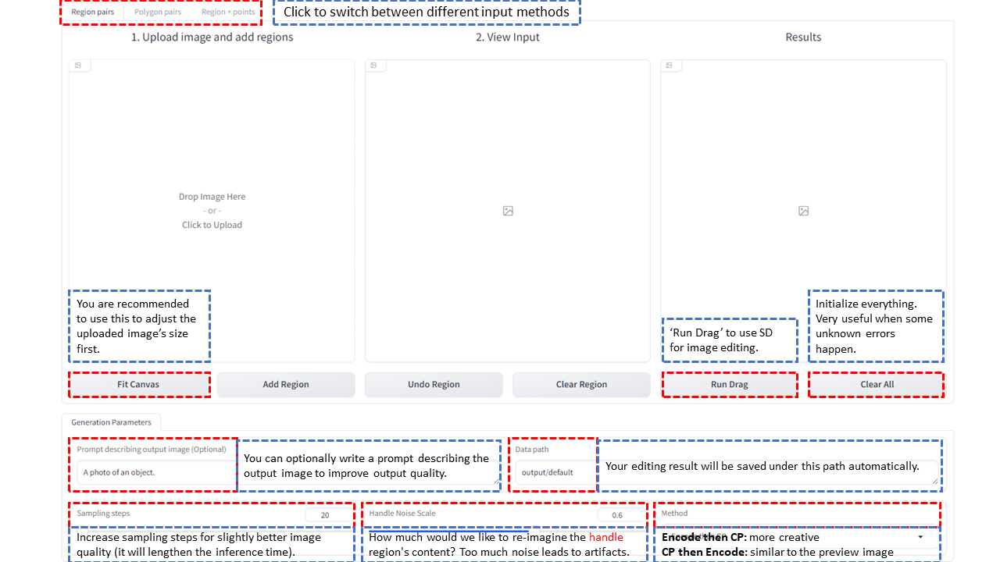

# RegionDrag: Fast Region-Based Image Editing with Diffusion Models (ECCV 2024)
 **Jingyi Lu†, [Xinghui Li‡](https://xinghui-li.github.io/), [Kai Han†](https://www.kaihan.org/)** 
[Visual AI Lab, The University of Hong Kong†](https://visailab.github.io/index.html); [Active Vision Lab, University of Oxford‡](https://www.robots.ox.ac.uk/ActiveVision/)

 
 
  

## Overview
RegionDrag supports a variety of inputs. You can input regions or points to drag image contents from 🔴 **RED** to 🔵 **BLUE**. Below is a overview of different components in our UI. For detailed instructions to install RegionDrag, check out our [README](./README.md).

## Tips
- Increasing the `Handle Noise Scale` can remove handle content. If it does not work, you can drag 🔴 some other contents to cover 🔵 the contents you would like to remove.
- The image displayed in the `Results` column is a preview obtained from your inputs before using `Run Drag`. A better preview generally implies a better editing result.
- If you find the preview image satisfactory, you can try changing the `Method` from `Encode then CP` to `CP then Encode`.

## Input pairs of regions
- **Step 1:** Upload one image on the left, and click `Fit Canvas` to adjust size of image
- **Step 2:** Add Regions (Draw mask on the left, and then click `Add Region`)
- **Step 3:** Click `Run Drag`

## Input pairs of polygons
- **Step 1:** Upload one image on the left, and click `Fit Canvas` to adjust size of image
- **Step 2:** Click points on the middle image (You can select to input triangles or quadrilaterals)
- **Step 3:** Click `Run Drag`

## Input regions and manipulate them by points
- **Step 1:** Upload one image on the left, and click `Fit Canvas` to adjust size of image
- **Step 2:** Draw masks to represent regions on the left
- **Step 3:** Click points to control these regions in the middle
- **Step 4:** Click `Run Drag`

